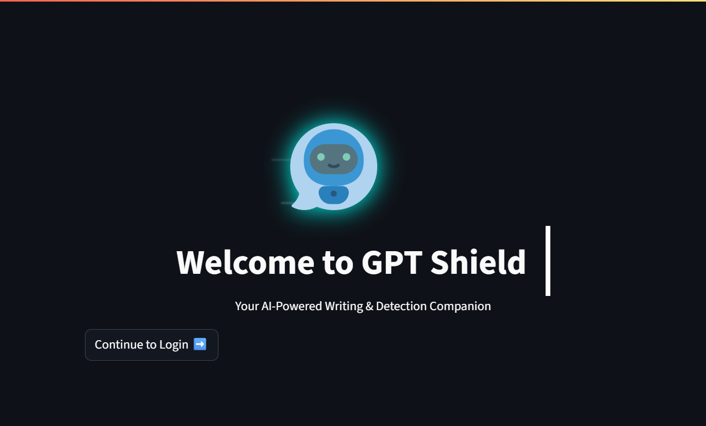
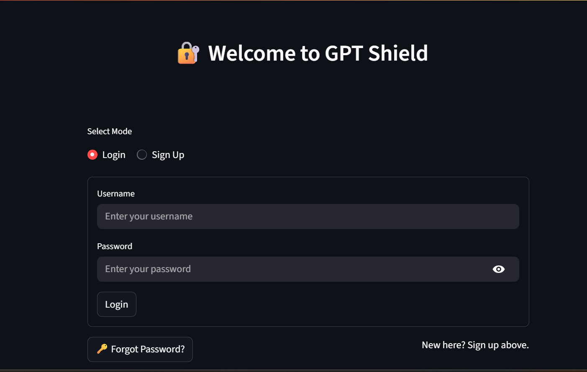
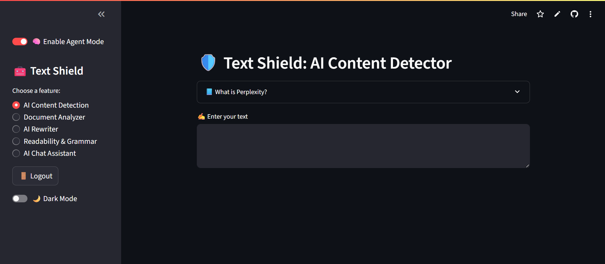
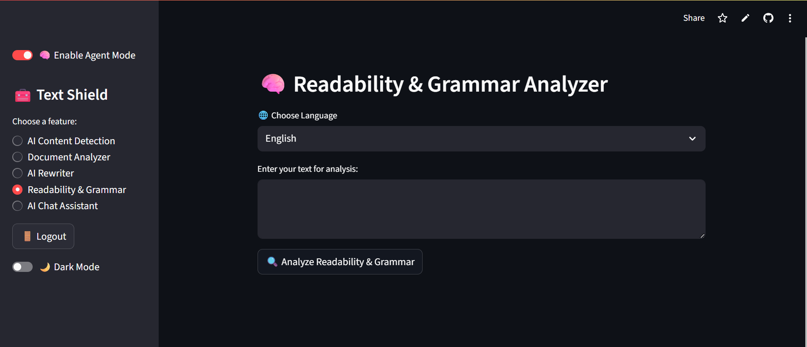
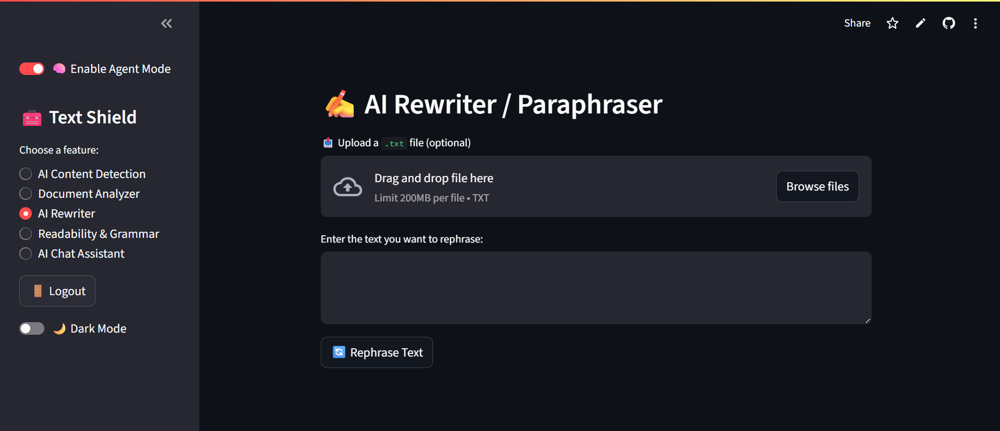
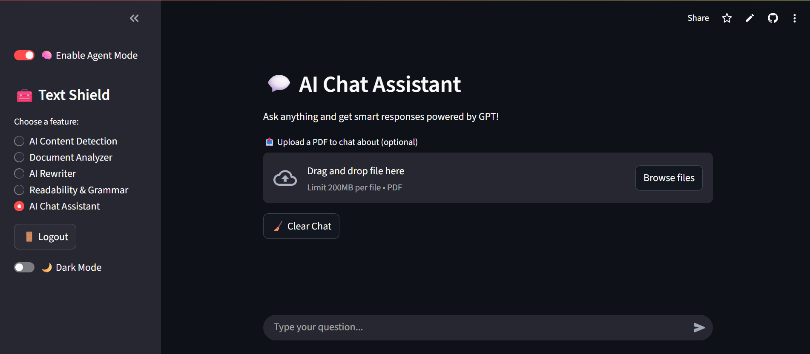

# 🛡️ TextShield – AI-Powered Writing & Detection Suite

 **Detect. Rewrite. Analyze. Secure.**  
 
 Your all-in-one toolkit for smarter text handling powered by AI, built using Streamlit, Google Gemini, and modern NLP.


---

## 🚀 Project Overview

TextShield is a modular, AI-powered web app built with Python and Streamlit that offers:
- ⚡ AI vs Human Content Detection (Perplexity + Burstiness)
- 🧠 Gemini-Powered Rewriting & Grammar Fixing
- 📄 Document Analysis with PDF/Word/Text Support
- 🔊 Text-to-Speech & Readability Analysis
- 💬 Chat Assistant with Optional PDF Memory
- 🔐 Secure Login System with Password Strength Checks

> Built for writers, educators, reviewers, and AI-curious folks who want deep insights into how content *reads* — and who wrote it.

---
# 🚀 Live Demo

Check out the app here: [Click to Open in Streamlit]([https://your-app-url.streamlit.app](https://textshield-7ybu5liimhkjdwi2srzyzv.streamlit.app/))


## Screenshots
### 🏠 Home page


### 🔐 Login Screen


### 🔍 Content Detection


### 📄 Document Analyzer


### 🧠 Grammar & Readability


### 📝 Rewriter


### 💬 Chatbot

---
## 🧩 Features

### 🧠 AI Content Detection
- Uses **GPT-2-based Perplexity** & **Burstiness metrics**
- Classifies text as:
  - ✅ Human-Written
  - 🤖 Possibly AI-Assisted
  - 🔍 AI-Generated

### 📄 Document Analyzer
- Upload `.txt`, `.pdf`, or `.docx`
- Extracts text and auto-analyzes it
- One-click report download

### 🔄 AI Rewriter (Gemini API)
- Rephrases text in natural or formal tone
- Supports manual input or file upload
- Agent mode toggle for dynamic prompting

### ✍️ Readability & Grammar Checker
- Calculates **Flesch Reading Ease**
- Shows grade level
- Fixes grammar using Gemini or LanguageTool
- Converts corrected text to **speech** using gTTS

### 💬 AI Chat Assistant
- Smart assistant powered by Gemini
- Remembers chat context
- Optional PDF upload for file-aware Q&A

### 🔐 Authentication System
- Secure **Login / Sign Up / Reset Password**
- Password strength checker (live validation)
- Session-based access control

---

## 🛠️ Tech Stack

| Category       | Tools/Libraries |
|----------------|------------------|
| Frontend UI    | Streamlit, Plotly |
| AI Models      | Google Gemini API, GPT-2 (Huggingface) |
| NLP Tools      | NLTK, Textstat, gTTS, LanguageTool |
| File Handling  | PyMuPDF, python-docx |
| Auth & Storage | bcrypt, JSON DB |
| Voice & Audio  | speechrecognition, pydub |

---


## 🛠️ Setup Instructions

Follow these steps to get TextShield running locally:

### 🔹 1. Clone the Repository
```
git clone https://github.com/bhoomika-choudhari/TextShield.git 
cd TextShield 
```
### 🔹 2. Install Dependencies

Make sure you have Python ≥ 3.8 installed, then install all required packages:

```
pip install -r requirements.txt
```

### 🔹 3. Configure Secrets

Create a file named .streamlit/secrets.toml and add your Gemini API key:

```
GEMINI_API_KEY = "your_google_gemini_api_key"
```

️⚠️ Do not commit this file to version control.

### 🔹 4. Run the Application

Start the Streamlit app:

```
streamlit run frontend.py
```

Once the app starts, it will automatically open in your default browser.

## 🔐 Important Notes

- users.json is excluded from this repo for security reasons.

- Keep your .streamlit/secrets.toml private and never push it to GitHub.

- A .gitignore file is already set up to keep sensitive or unnecessary files out of version control.


## 🧠 Future Enhancements

- 🔍 AI Text Similarity Checker

- 📝 Auto-Summarizer for PDFs

- 🌐 Deployment via Streamlit Cloud / Hugging Face Spaces

- 🛡️ OAuth2 Login (Google / GitHub)


## 🤝 Contributing
Pull requests are welcome!
For major changes, please open an issue first.
Let’s build the ultimate AI-powered text assistant together.

## 📢 Connect with Me
👩‍💻 Ashi Sharma

🔗 LinkedIn  ```www.linkedin.com/in/ashi-sharma-54b760231```

👩‍💻 Bhoomika Choudhari

🔗 LinkedIn  ```www.linkedin.com/in/bhoomika-choudhari-0616a2274```
